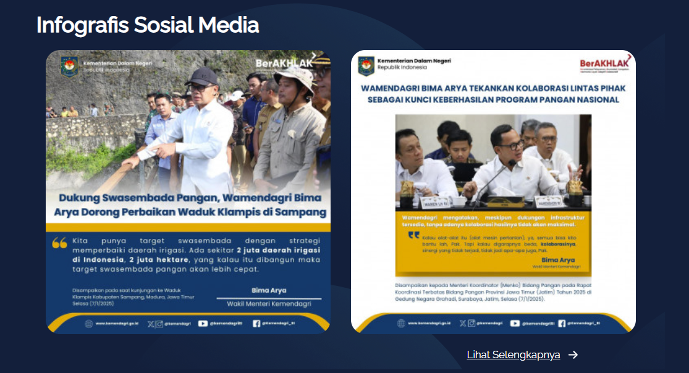
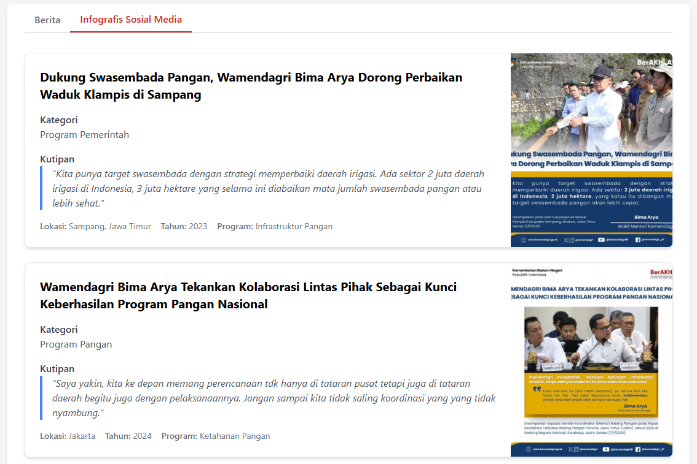
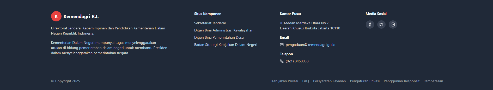

# Kemendagri Website Redesign Project

## Kelompok 1

- Abdur Rozaq
- Adli Putraliani
- Muhammad Zidan

## Overview

This project aims to improve the official website of Kementerian Dalam Negeri Republik Indonesia (Kemendagri) both in design and implementation by rebuilding it using modern web technologies. Our approach focuses on enhancing user experience, accessibility, and performance while maintaining the integrity of the content and services provided by the ministry.

## Technologies Used

- React 19
- TypeScript
- Tailwind CSS
- Vite

## Project Objectives

1. Redesign key components of the Kemendagri website
2. Improve the responsive behavior across different devices
3. Enhance accessibility features
4. Optimize performance through modern web technologies
5. Maintain content integrity while improving visual presentation

## Project Structure

```
project-wcd07-kelompok01/
├── .git/            # Git repository
├── .gitignore       # Git ignore configuration
├── docs/            # Documentation assets
│   ├── after_footer.png
│   ├── after_infografis.png
│   ├── before_footer.png
│   └── before_infografis.png
├── node_modules/    # Node.js dependencies
├── public/          # Static assets
│   ├── vite.svg
│   └── images/      # Image assets
├── src/
│   ├── assets/      # Source assets
│   │   └── react.svg
│   ├── components/  # Core components
│   │   ├── Berita.tsx
│   │   ├── Body.tsx
│   │   ├── Footer.tsx
│   │   ├── Header.tsx
│   │   ├── HeroBanner.tsx
│   │   ├── InfografisCard.tsx
│   │   └── Pagination.tsx
│   ├── types/       # TypeScript type definitions
│   │   └── index.ts
│   ├── App.css      # Application styles
│   ├── App.tsx      # Main application component
│   ├── index.css    # Global styles
│   ├── main.tsx     # Entry point
│   └── vite-env.d.ts # Vite environment types
├── eslint.config.js # ESLint configuration
├── index.html       # HTML entry point
├── package.json     # Project dependencies and scripts
├── postcss.config.js # PostCSS configuration
├── README.md        # Project documentation
├── tailwind.config.js # Tailwind CSS configuration
├── tsconfig.app.json # TypeScript configuration for app
├── tsconfig.json    # TypeScript configuration
├── tsconfig.node.json # TypeScript configuration for Node
├── vite.config.ts   # Vite configuration
└── yarn.lock        # Yarn lock file
```

## Component Redesigns

### 1. Header Component

**Contributor: Adli Putraliani**

### 2. Berita Component

**Contributor: Muhammad Zidan**

### 3. Infografis Sosial Media Component

**Contributor: Abdur Rozaq**

#### Before:

The original Infografis section on the Kemendagri website had several usability and design issues:

- Inconsistent visual hierarchy
- Limited mobile responsiveness
- Poor separation between different infographic items
- Text overflow issues with longer titles or descriptions
- Inconsistent spacing and alignment
- Limited visual distinction between different content types
  

#### After:

Our redesigned `InfografisCard` component addresses these issues with:

- Clean, card-based layout with proper spacing and shadows
- Responsive design that adapts to different screen sizes
- Consistent typography with clear visual hierarchy
- Blue accent for quotations to highlight important statements
- Structured metadata display (location, year, program)
- Improved image handling with error fallbacks
- Clear content separation for better readability
- Proper overflow handling for various content lengths
  

### 4. Footer Component

**Contributor: Abdur Rozaq**

#### Before:

The original footer had several limitations:

- Dense, difficult-to-scan information structure
- Inconsistent spacing and alignment
- Limited responsive design for mobile devices
- Poor visual hierarchy of information
- Lack of clear section separation
- Limited accessibility features
  

#### After:

Our redesigned Footer addresses these issues with:

- Modern, clean three-column layout (on desktop)
- Responsive design that adapts to mobile with appropriate stacking
- Clear visual hierarchy with section headings
- Improved spacing and content organization
- Interactive social media links with hover effects
- Proper semantic HTML structure with address tag
- Consistent typography and color scheme
- Icon integration for better visual cues
- Clear separation between main content and copyright section
  

## Implementation Details

### Technology Upgrade

- Migrated from older technologies to React 19 with TypeScript
- Implemented Tailwind CSS for consistent, responsive styling
- Used Vite for faster development and optimized production builds
- Added Lucide React for modern, accessible icon components

### Accessibility Improvements

- Semantic HTML structure
- Proper color contrast
- Keyboard navigation support
- Screen reader friendly components

### Performance Enhancements

- Optimized component rendering
- Improved image handling
- Reduced unnecessary re-renders
- Modern build tooling for smaller bundle sizes

## Getting Started

### Prerequisites

- Node.js (v18 or newer)
- npm or yarn

### Installation

```bash
# Clone the repository
git clone [repository-url]

# Navigate to project directory
cd project-wcd07-kelompok01

# Install dependencies
npm install

# Start development server
npm run dev
```

### Building for Production

```bash
npm run build

# Preview production build
npm run preview
```
